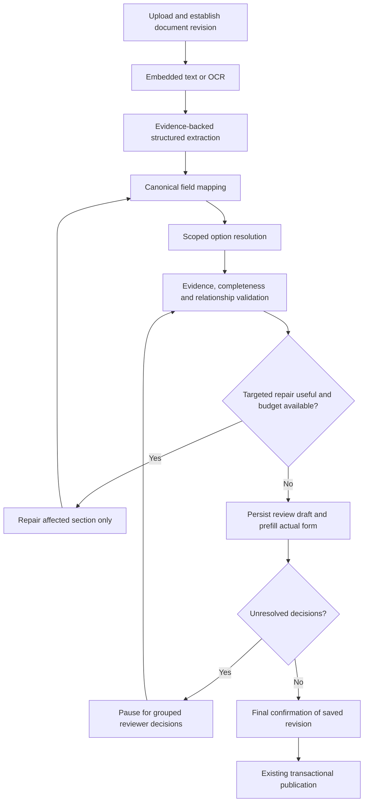

# Prescription automation: implementation plan and task tracker

Created: 2026-10-01 (Asia/Dhaka)

Status: 40/46 main tasks accepted (87.0%), verified on 2026-10-02 Asia/Dhaka. Actual-form prefill, checked fact decisions, saved-revision publication, durable extraction orchestration and safe artifact reuse are implemented. Narrow opt-in repair execution is implemented; Explicit saved-proposal adoption, synthetic shadow comparison and deployment preparation are implemented. External production release gates remain pending.

## Outcome

Upload a prescription, automatically populate the actual entry form, resolve unambiguous canonical options, and ask the reviewer only for exceptions and final confirmation. Preserve source evidence and use the existing shared clinical persistence service.

LangGraph coordinates a bounded workflow; it does not independently make clinical decisions or publish records. No system can guarantee error-free extraction. This plan aims to prevent silent omissions, unsupported mappings, duplicate writes, and unbounded retries.

## How we execute and track work

Authorized engineering implementation and final local verification are complete as of 2026-10-02. The recurring implementation heartbeat is disabled; the remaining six main tasks are explicit owner/clinical/deployment release gates. Continue release work when the required evidence is supplied; no production activation is inferred from engineering completion.

- Execute phases in order. Independent tasks inside a phase may be reordered when their prerequisites are met.
- Before starting a task, inspect the current code and record the chosen approach in Execution notes.
- Leave its checkbox unchecked while working. Record `in progress` or `blocked` in Execution notes when applicable.
- Mark a task `[x]` only when its acceptance criteria and appropriate verification pass.
- After every completed task or engineering milestone, report the total main-task completion percentage and completed/total count. Count only fully accepted `P` tasks, never partial subtasks; recalculate from this tracker. User requirement recorded 2026-10-02.
- Record the completion date, files changed, checks and results, and any limitations in Completion log. Tests that were not run must be identified explicitly.
- Do not equate a passing build with completed functionality. Check behavior and persistence at the changed layer.
- Do not mark an entire phase complete while required tasks remain unfinished.
- Prior UI patches and installed dependencies are existing foundations, not evidence that these new tasks are complete.
- Update this file as implementation proceeds. Scope changes require updating the task and criteria before marking completion.

## Existing foundations to verify during phase 0

- Django/DRF registry, options catalog, and React actual entry/review form.
- Embedded-text extraction, OCR fallback, deterministic extraction, and Gemini enrichment.
- Celery extraction queue, retry handling, and an existing batch path.
- Canonical draft normalization and conservative option resolution.
- Shared `persist_canonical_draft` persistence and transactional publication with retry mapping.
- `LLMInvocation` auditing.
- LangGraph 1.2.11 and google-genai 2.24.0 were found in the local venv during planning. Deployment compatibility still requires verification.
- Recent UI changes show extracted dropdown text and support some historical pathology field aliases. Full schema coverage and separation of immutable evidence from reviewer decisions remain to be verified.

## Operating boundaries

1. Raw extraction is immutable evidence; canonical selections and reviewer edits are separate, versioned data.
2. Every returned fact has a recorded disposition: mapped, unresolved, or explicitly excluded with a reason.
3. Auto-selection requires an unambiguous, valid, scope-correct canonical match under a documented rule.
4. Missing options never cause invented IDs or automatic catalog creation.
5. A patient association always requires an explicit authorized selection; uncertain identifiers remain unresolved.
6. Dates and distinct historical events are retained; historical dates do not automatically create visits.
7. Repair cannot overwrite reviewer-owned fields or imply administration, progression, death, or other unsupported clinical facts.
8. Publication requires final approval of the current saved revision and current server validation.
9. Manual entry and prescription entry keep the same validation and persistence path.
10. Uploaded content is data, never agent instructions. The graph has narrowly defined tools and no arbitrary SQL, shell, network, or database-write tool.

## Target workflow



## Phase 0 — Baseline, data handling, and design decisions

- [x] **P0.1 Audit the current end-to-end flow.** Inspect models, migrations, serializers, services, direct/batch tasks, permissions, options, frontend bindings, and installed/runtime dependencies. Acceptance: document actual read/write paths and deployment gaps; confirm audit migrations and permissions rather than assuming their state. Completed 2026-10-01; evidence: [baseline audit](prescription-agentic-baseline-audit.md).
- [ ] **P0.2 Establish provider/data handling rules.** Owner-selected testing now uses the existing unpaid Gemini API and real uploaded prescriptions with clinician validation; the separate synthetic suite remains isolated. Acceptance: record the permitted data class, production provider arrangement, and enforcement point before sending production patient documents; partial name removal alone is insufficient.
  - [x] Development policy documented and shared exact-input gate added to direct/batch Gemini calls; local extraction preserved. Verification recorded in [provider data policy](prescription-provider-data-policy.md).
  - [x] Owner explicitly confirmed unpaid Gemini and real uploaded prescriptions for current testing with clinician validation, declining billing; enabled policy supports this choice.
  - [ ] General production-release purpose/data arrangement sign-off recorded; current test authorization is not represented as final release approval.
- [x] **P0.3 Prepare a reviewed evaluation set.** Cover representative text PDFs, scans, repeated events, conflicting dates, empty catalogs, and alternate field names. Acceptance: fixtures have expected facts, source evidence, mappings, and exceptions; no live identifiers in committed fixtures.
- [x] **P0.4 Define baseline measurements and release gates.** Measure missing facts, incorrect selections, correct prefill, reviewer corrections/time, calls per document, and failure/recovery rates. Acceptance: agree explicit thresholds per field/risk category before pilot activation, with zero tolerated invented IDs, unauthorized writes, and duplicate publication in fault tests. Accepted 2026-10-03: owner chose the strict clinician pass rule (100% fact accounting, correct every missing/wrong clinical field, zero unresolved critical errors published, clinician validates each saved draft). Metrics are defined in prescription-evaluation-and-release.md; observed cohort measurements remain P6.1.
- [x] **P0.5 Choose durable state and concurrency design.** Inspect the current database and worker deployment before choosing the checkpoint adapter and any new models. Acceptance: record orchestration state ownership, Django draft authority, checkpoint lifecycle/retention, run identity, lock/lease strategy, and revision semantics.

Gate: baseline and provider/data handling decisions recorded; test fixtures available.

## Phase 1 — One field contract and complete mapping

- [x] **P1.1 Inventory every actual form field.** Include patient, observation context, anthropometry, diagnosis, pathology, molecular, treatment, procedures, and outcomes. Acceptance: field/resource/dependency matrix matches backend models and frontend controls; unsupported destinations are explicit.
- [x] **P1.2 Define a versioned machine-readable extraction/mapping contract.** Acceptance: field names, types, cardinalities, date rules, option resources, relationships, evidence metadata, and null/absent semantics are explicit; Gemini and frontend definitions are derived from or checked against the contract.
- [x] **P1.3 Add provider structured-output schema and server validation.** Acceptance: model configuration remains explicit; malformed/truncated/blocked/schema-invalid responses are classified; valid JSON alone cannot bypass domain validation.
- [x] **P1.4 Implement compatibility normalization.** Acceptance: known legacy aliases map only where semantically equivalent; conflicting alias/canonical values become exceptions; narratives are not silently interpreted as controlled diagnoses or types.
- [x] **P1.5 Separate immutable evidence, proposed values, and reviewer decisions.** Acceptance: source text/value/page and provenance survive selection, clearing, save/reload, split/merge/move, and repair; evidence is not overwritten by canonical IDs or labels.
- [x] **P1.6 Add fact disposition and coverage accounting.** Acceptance: every returned fact is mapped, unresolved, or explicitly excluded; unsupported keys and unrepresented clinical sections cannot disappear behind a successful status. Coverage checks detect suspected omissions without inventing missing facts.
- [x] **P1.7 Verify field coverage end to end.** Acceptance: fixtures for every section reach the actual form and save/reload correctly through existing validation; regression tests include the observed pathology payload mismatch.

Gate: no unexplained dropped facts and no parallel clinical persistence path.

## Phase 2 — Automatic canonical resolution and validation

- [x] **P2.1 Define and implement safe auto-resolution rules.** Acceptance: unique exact, approved-alias, and explicitly approved normalization/code matches select canonical options; ambiguous/fuzzy matches remain suggestions; resolution records its rule and catalog revision/fingerprint.
- [x] **P2.2 Enforce parent-scoped option dependencies.** Acceptance: disease subgroup, gene/exon, panel/version/target, protocol/drug and other actual relationships are validated; changing a parent invalidates stale dependent selections.
- [x] **P2.3 Handle absent and empty catalogs.** Acceptance: evidence remains visible, unaffected fields remain populated, and a actionable catalog exception identifies the resource; no automatic option or alias creation. Completed 2026-10-02; evidence in empty-catalog completion log below.
- [x] **P2.4 Validate source support and chronology.** Acceptance: page references and evidence checks distinguish supported, uncertain, and conflicting facts; ambiguous dates, prescribed/administered status, and unsupported clinical inferences remain exceptions. LLM self-confidence alone never grants acceptance.
- [x] **P2.5 Reconcile deterministic and Gemini records.** Acceptance: overlapping facts are reconciled conservatively; repeated events are preserved; contradictory findings stay separate and visible; no synthetic visit IDs.
- [x] **P2.6 Consolidate readiness rules.** Acceptance: server and UI agree on blocking issues, informational warnings, optional absent fields, and record readiness; a warning alone does not require an unnecessary reviewer click.
- [x] **P2.7 Verify resolution and validation behavior.** Acceptance: tests cover ambiguous aliases, duplicate option labels, nonexistent IDs, wrong parent scope, empty catalogs, multiselect values, conflicts, and stale catalogs.

Gate: routine valid mappings complete automatically; uncertainty cannot silently become a selected value.

## Phase 3 — Durable LangGraph orchestration

- [x] **P3.1 Define typed graph state and statuses.** Acceptance: state includes document revision, run identity, schema/prompt/model versions, artifact references, catalog version, issue dispositions, budgets, reviewer revision, and stage results. Django remains authoritative for clinical data and decisions.
- [x] **P3.2 Wrap existing services as graph nodes.** Acceptance: extraction, normalization, resolution, validation, and draft persistence reuse established services; no new clinical write path and no model-selected arbitrary tools. Completed 2026-10-02; checkpointed extraction graph verified below.
- [x] **P3.3 Add persistent checkpointing.** Acceptance: an interrupted run survives worker restart and resumes with stable identity; checkpoint access and retention follow clinical-data permissions. In-memory checkpointing is development-only.
- [x] **P3.4 Integrate graph execution with Celery.** Acceptance: Celery schedules work and delayed retries; graph routes stages; one layer owns each retry category. Long waits do not hold a worker unnecessarily.
- [x] **P3.5 Add narrow targeted repair.** Acceptance: only repairable failures and relevant source sections are submitted; patches are field-allowlisted, evidence-backed, revalidated, and compared against the current revision. Reviewer-owned fields are protected.
- [x] **P3.6 Enforce attempt/token/time budgets.** Initial proposal: one extraction plus at most one targeted repair per document. Acceptance: limits are configurable and observable; exhausted budgets yield a usable exception draft without recursive repair loops.
- [x] **P3.7 Make local side effects replay-safe.** Acceptance: crashes and task redelivery do not duplicate draft operations or publication. Record ambiguous provider attempts honestly; checkpointing does not claim exactly-once external API invocation.
- [x] **P3.8 Verify pause/resume and replay.** Acceptance: tests include crash before/after provider response, checkpoint failure, duplicate delivery, document revision change, reviewer edit during repair, and interrupted review resume.

Gate: restart-safe, bounded orchestration with protected reviewer changes.

## Phase 4 — Quota, audit, and operational recovery

- [x] **P4.1 Add shared provider quota coordination.** Acceptance: configured project/model request and token budgets apply across workers and direct/batch paths; limits use verified project settings, not assumed free-tier numbers. Completed 2026-10-03 using owner-reported AI Studio limits (15 RPM, 500 RPD, 250K TPM), shared minute/day admission, Pacific-midnight reset, atomic rollback, and deployed configuration checks. Token admission uses conservative units rather than claiming provider-measured tokens.
- [x] **P4.2 Classify failures and schedule appropriate recovery.** Acceptance: quota, transient service failure, authentication/configuration failure, invalid output, and daily exhaustion have distinct handling; retry timing respects provider guidance and avoids synchronized retries.
- [x] **P4.3 Reuse completed artifacts safely.** Acceptance: retries reuse OCR and completed stages; cache identity includes relevant document/schema/prompt/model/input versions and approved data partition; reviewer drafts are not replaced by cached extraction.
- [x] **P4.4 Extend invocation and stage auditing.** Acceptance: every extraction/repair attempt has invocation provenance, usage, status, and sanitized error category; prompts/responses remain restricted audit data, never general telemetry. New operational models receive migrations, searchable read-only admin where appropriate, and permissions.
- [x] **P4.5 Provide recovery controls and runbook.** Acceptance: documented actions for quota waiting, failed nodes, cancellation, restart, catalog correction, and rollback; progress states distinguish queued/waiting/failed/needs-review/ready accurately.
- [x] **P4.6 Verify operational failure handling.** Acceptance: concurrent-worker limits, quota exhaustion, cancellation, provider outage, disabled model configuration, and audit permissions are tested.

Gate: quota or provider failure preserves work and never triggers unbounded API calls.

## Phase 5 — Actual form prefill and exception-focused review

- [x] **P5.1 Prefill every supported field on the actual form.** Acceptance: dates, text, summaries, numbers, and resolved options populate directly; original extracted values are independently visible even with matching or empty catalogs.
- [x] **P5.2 Add one grouped exception list.** Acceptance: each issue explains the source fact, reason, affected field, suggested choices, and required action; selecting an issue focuses its actual field.
- [x] **P5.3 Remove unnecessary per-record validation clicks.** Acceptance: server-validated routine records become ready automatically; optional absent values do not create artificial blockers; critical uncertainty stays blocking.
- [x] **P5.4 Persist reviewer decisions and resume affected checks.** Acceptance: decisions use existing authenticated APIs, remain revisioned, and recheck only affected nodes without repeating full extraction.
- [x] **P5.5 Provide authorized catalog/alias correction workflow.** Acceptance: missing option issues can be resolved through approved administration; aliases require explicit approval and correct scope before reuse; pending proposals do not become auto-selection rules.
- [x] **P5.6 Confirm and publish the saved revision once.** Acceptance: dirty changes save successfully before approval; stale approval is rejected; publication revalidates current catalog and permissions and uses the existing atomic retry-safe publisher.
- [x] **P5.7 Verify full reviewer journeys.** Acceptance: clean auto-prefill, ambiguous mapping, missing catalog, save/reload, split/merge/move, repair concurrency, and final approval journeys pass appropriate component/API/browser checks.

Gate: the reviewer resolves exceptions instead of re-entering the prescription.

## Phase 6 — Evaluation, pilot, and release

- [ ] **P6.1 Run the reviewed evaluation set.** Acceptance: publish field-level accuracy, omissions, incorrect auto-selections, correction burden, and calls per document against the phase-0 gates; investigate failures rather than hiding them in aggregate scores.
- [x] **P6.2 Complete security and fault verification.** Acceptance: uploaded instruction injection cannot alter tools, patient assignment, or publication; cross-user access fails; concurrent approval, task replay, stale revisions, and catalog changes cannot bypass safeguards.
- [x] **P6.3 Run shadow mode.** Acceptance: graph produces review-only comparison artifacts without overwriting current reviews or publishing; compare results with reviewed baseline and record evidence.
- [ ] **P6.4 Enable a limited pilot behind a feature flag.** Acceptance: rollback to the existing extraction route is tested; existing drafts and provenance remain readable; agreed pilot gates pass.
- [x] **P6.5 Document deployment and ownership.** Acceptance: dependency pins, migrations, checkpoint setup, model/quota settings, admin permissions, worker startup, recovery, retention, and responsible owners are documented.
- [ ] **P6.6 Release after explicit gate review.** Acceptance: all required phases complete, unresolved limitations documented, and production data handling approved for the selected provider. Final human approval remains part of publication; removing it is outside this plan.

Gate: measured improvement in reviewer effort with accepted field-level quality and verified recovery behavior.

## Definition of done

- Actual forms are automatically populated across all supported sections.
- Every returned fact is accounted for and its original evidence remains inspectable.
- Routine canonical mappings require no individual validation click.
- Missing, ambiguous, unsupported, or conflicting facts remain visible and actionable.
- Save/reload and retries preserve decisions and evidence.
- Patient association and final publication require explicit authorized actions.
- Quota exhaustion and worker crashes preserve progress without duplicate clinical writes.
- Manual and prescription entry share validation and persistence.
- Evaluation gates, layer-appropriate checks, deployment setup, and rollback pass.
- Task checkboxes and completion evidence reflect the actual implemented state.

## Execution notes

Next: P3.5/P3.6 bounded targeted repair; complete P1.7 all-section persistence, P2.4/P2.5 source/chronology reconciliation and remaining operational/reviewer/evaluation tasks. P0.2 production confirmation remains pending independently.

P0.1 completed (2026-10-01, Asia/Dhaka): repository paths inspected, local migration/admin/permission state verified, installed dependencies checked, existing backend/frontend checks passed, and findings recorded in the [baseline audit](prescription-agentic-baseline-audit.md). Local findings do not certify production deployment or clinical extraction accuracy. No provider calls or production changes were made.

P0.2 approach: use synthetic fixtures for graph development; establish explicit permitted data classes and production provider suitability, then design a shared enforcement point for direct and batch requests. Do not infer paid/suitable data processing merely because an API key is configured.

P0.2 in progress (2026-10-01, Asia/Dhaka): shared outbound-input policy gate implemented and verified. Direct/batch default transmission is disabled; an explicit review reference plus exact-input digest allowlist permits reviewed non-sensitive fixtures. Local extraction and drafts remain available, and the UI identifies policy blocks truthfully. Production purpose/provider arrangement requested from the user and still pending; do not mark P0.2 complete until that acceptance criterion is resolved. See [provider data policy](prescription-provider-data-policy.md).

## Completion log

### P0.1 — Baseline audit

- Completed on: 2026-10-01 (Asia/Dhaka).
- Behavior implemented: baseline documentation and task tracking; no runtime behavior changed.
- Files changed: this tracker and `docs/prescription-agentic-baseline-audit.md`.
- Verification: Django system check passed; all prescriptions/options/records migrations applied locally; migration dry-run found no changes; pip dependency check passed; 50 backend tests and 14 frontend tests passed; TypeScript/Vite build passed with existing large-chunk warning; local no-network LangGraph smoke passed; read-only database metadata checks confirmed audit registration/permission and option availability.
- Material findings: 30 of 53 clinical option resources empty locally; no durable checkpoint adapter installed; no full field contract, stage checkpoints, shared quota ledger, or review revision protection; batch sync mutates completed extraction artifacts. Audit table and view permission exist, but zero groups hold the view grant (individual/superuser access not enumerated).
- Limitations: production deployment/broker/provider quota/data arrangement, browser journeys, clinical ground truth, and fault/concurrency scenarios not verified. Subsequent task references and acceptance gates are recorded in the audit.
- Next: P0.2.

### P0.2 — Completed engineering subtask; production decision pending

- Engineering verified on: 2026-10-01 (Asia/Dhaka). Parent task remains incomplete.
- Files changed: shared provider policy service; direct/batch extraction and processing/API boundaries; Django settings and example environment; policy tests; prescription queue status text; this tracker and provider-policy document.
- Verification: initial full backend suite passed 57 tests; expanded nine-case policy suite passed; Django check and migration dry-run passed; frontend production build passed with existing chunk warning; fresh-process settings confirm disabled policy with no approved input digests.
- No real provider calls, private environment edits, migrations, or production restarts performed.
- Behavior change: after application/worker reload, ordinary uploads are no longer sent to Gemini by default. Reviewed exact non-sensitive inputs can be explicitly enabled; unapproved content retains local extraction with a policy exception.
- Outstanding acceptance criterion: owner confirmation of production purpose and suitable provider/data arrangement. Synthetic fixture preparation (P0.3) can proceed independently while that decision is pending.

For each completed task, append:

```text
Task ID:
Completed on (Asia/Dhaka):
Behavior implemented:
Files changed:
Verification commands/scenarios and results:
Limitations or follow-up tasks:
```

## Reference documentation

Current executable graph scope and rollout limits: [mapping graph runbook](prescription-mapping-graph-runbook.md).

- Gemini structured outputs: https://ai.google.dev/gemini-api/docs/structured-output
- Gemini project rate limits: https://ai.google.dev/gemini-api/docs/rate-limits
- Gemini API terms and unpaid-service data handling: https://ai.google.dev/gemini-api/terms
- LangGraph persistence: https://docs.langchain.com/oss/python/langgraph/persistence
- LangGraph interrupts and node replay behavior: https://docs.langchain.com/oss/python/langgraph/interrupts

Recheck provider terms, active quota, and installed API compatibility during implementation; planning references are not permanent guarantees.

### Autonomous execution milestones - 2026-10-01

- User authorized continuous task-by-task execution during their break; proceed with independent development while production decisions remain pending.
- P0.3 completed: ten hand-annotated synthetic cases, fixture integrity tests, temporary text-PDF/scanned-image OCR routing tests. Engineering-reviewed expectations only; real OCR quality and clinician-certified ground truth are later release gates.
- P0.5 completed: inspected PostgreSQL and the checked-in Celery worker deployment arrangement; chose Django/PostgreSQL checkpoints, stable workflow identities, leases and reviewer revisions. See prescription-workflow-state-design.md. Live production worker health is not certified.
- P1.1 completed: generated inventory of 164 exposed field definitions (142 clinical fields in 17 collections), checked against Django destination metadata. Missing destinations are explicit. See prescription-field-inventory.md.
- P1.2 completed: canonical JSON contract consumed by React field definitions, patient fields, backend option resources, and generated provider response schema. Field types, cardinalities, enum values, aliases and dependencies are explicit; derived fields stay read-only.
- P1.4 completed: backend alias normalization handles historical pathology, diagnosis narrative, IHC, molecular result and marker names; conflicts remain unresolved. Patient identifier aliases do not bypass deterministic-only identification.
- Verification to this milestone: 65 backend tests passed; 14 frontend tests passed; production build passed; all ten synthetic mapping cases met expected fields, exceptions and fact counts in evaluate_prescription_fixtures. Follow-up immutable-identity test added for the next suite run.
- P0.4 development metrics/gates documented in prescription-evaluation-and-release.md; production field-specific threshold agreement remains provisional, so the parent checkbox stays open.

### Subsequent verified milestones — 2026-10-01

- P1.3 completed: direct and batch requests use the generated structured schema; server validation rejects invalid evidence envelopes and database IDs. Provider completion checks distinguish empty, malformed, truncated, blocked, incomplete and schema-invalid output. No live provider request was used for verification.
- P3.1 completed: typed orchestration state includes source/version identities, artifacts, stage results, dispositions, review revision and budget counters/deadline. Run admission uses bounded database leases and source revision checks.
- P5.3 completed: server marks complete records ready automatically; the UI removes the per-record validation button and derives readiness from required fields and every populated controlled selection. Optional blanks remain optional; unsupported destinations and unresolved options remain blocking.
- P2.1/P2.2 engineering progress: matches record a catalog/alias fingerprint; clinical polarity/comparison signs survive normalization; parentless child choices remain unresolved; protocol drug matching respects membership; multi-select matching preserves unmatched facts. The UI invalidates downstream dependent choices on parent changes. Full hierarchical/browser journeys remain pending, so parent tasks stay unchecked.
- P1.5/P1.6 progress: immutable original record values, evidence values and source quotes are retained independently from edits; save guards reject changed provenance and fabricated identities; unsupported fields/invalid values/unsupported destinations have explicit dispositions. Patient/context accounting, explicit exclusion decisions and repair journeys remain unfinished.
- Fixed actual-form treatment administration persistence: flat drug/date/cycle/day/dose/unit/status/notes create the canonical administration child. No administration status is inferred from the course status; mixed flat/nested inputs and ambiguous course links are rejected. Child provenance uses actual source evidence.
- P3.2/P3.3/P3.4 progress: real normalization/resolution/validation/review-save graph with Django checkpoints/pending writes, lease checks and an explicit Celery task. Recreated-graph crash recovery and replay are tested; existing reviewer edits are preserved. OCR/Gemini stage integration, live worker restart, interrupts, quota and repair remain unfinished.
- Review revisions: current UI sends expected revision for save/approve/publish, and approves the revision returned by save. Row locks serialize mutations; stale supplied revisions return 409; new approvals bind their revision. Legacy revision-less API requests and historical null approved revisions remain compatible; strict rollout is still pending.
- Local database: migrations 0008 and 0009 applied successfully; operational models registered in searchable read-only admin. Admin payloads omitted; no public checkpoint endpoint. See mapping runbook for retention and deployment limitations.
- Verification: 84 backend tests passed before the final clinical-polarity regression; six focused option automation tests passed including that regression. 14 frontend tests passed; production build passed after all form changes; Django check/migration dry-run and ten synthetic corpus cases passed. Final complete suite result is recorded below when available. Existing Vite large-chunk warning remains.
- No production deployment, real Gemini call, patient publication or private environment change performed. Remaining checkboxes deliberately stay open.

Final verification on 2026-10-01: all 85 prescription backend tests passed, all 14 frontend tests passed, ten synthetic corpus cases passed, production build and Django check passed, migration dry-run found no changes, and git diff --check found no whitespace errors. Local migrations 0008 and 0009 are applied. No clinical writes or provider calls were used outside isolated tests.

### Continued execution after autonomy correction — 2026-10-01

- Activated the task-by-task continuation heartbeat; future runs use this tracker and continue independent implementation without requiring another instruction.
- Completed the batch immutable-import/replay subtask of P4.3/P3.7: each successful batch item creates a new completed ExtractionRun, retains the original extraction and reviewer-owned draft, records its source/item identity, verifies submitted input hash against current pages, and serializes item import under a row lock. Duplicate deliveries do not create another extraction or increment attempts. Missing/failed provider items no longer give a successful job status.
- [x] Batch immutable-import/replay subtask verified: all 87 backend tests passed; Django check and git diff --check passed. Files: services/batch.py and test_batch_replay.py. P4.3/P3.7 remain open for their other acceptance criteria.
- Focused verification: two synthetic batch-import tests passed. No live provider calls. Full regression result follows when available. Parent tasks remain open because OCR artifact reuse and full graph replay/fault coverage are still pending.
- Next engineering work: checkpoint OCR/Gemini stages and source artifacts, coordinate provider budgets across workers, and finish immutable fact dispositions and grouped exception decisions.

### Resumed implementation — 2026-10-02

- P4.3 in progress: complete ordered OCR/text artifacts are keyed by document SHA and extractor configuration; retries reuse page IDs. Replacement is committed only after extraction succeeds. New extraction runs retain a source-page snapshot; graph evidence validation uses that immutable snapshot when available.
- Fixed quota-error propagation: GeminiRateLimitError now reaches Celery's delayed retry path instead of being swallowed by generic deterministic fallback.
- Added four synthetic tests for artifact reuse, configuration invalidation, preservation after OCR failure, and quota retry reuse. Verification is in progress; do not mark the parent task complete yet. Django check and git diff --check passed.
- [x] Local artifact reuse and immutable source-snapshot subtask completed: all 92 prescription tests passed, including graph validation after current OCR pages change. Django check, migration dry-run and whitespace checks passed. No migrations required and no live provider calls made. P4.3 remains open for full stage/provider-version caching and worker recovery coverage.
- Current next task: shared provider budget coordination and extraction-stage checkpoint integration; the continuation loop remains responsible for the remaining engineering tasks.

### Heartbeat integrity correction — 2026-10-02

- While inspecting shared provider admission paths, found that real batch submission stored an envelope digest while import expected a source-text digest. Fixed new submission to store the source digest consistently; legacy items use their immutable invocation source digest for validation. Changed page text still fails closed.
- Three focused batch tests passed, including legacy-envelope compatibility. Django check and whitespace checks passed. Full regression verification follows; P4.1 remains pending and is not claimed complete.
- [x] Submission/import digest contract correction completed: full 93-test suite passed, followed by all four batch tests including the actual mocked submission-to-import path. No live provider calls. Shared quota coordination remains the next task.

### Shared provider admission implementation — 2026-10-02

- P4.1 engineering in progress: PostgreSQL counters keyed by configured project scope/model, atomic row-lock admission across workers, shared direct/batch reservations, explicit window/request/token-unit settings, and output caps in both provider request configurations. Oversize requests fail configuration validation; local exhaustion uses quota retries and batch HTTP 429/Retry-After. Reservations retain ambiguous/failed external attempts conservatively.
- Migration 0010 applied locally; budget counters registered in searchable read-only admin. Private environment unchanged; admission remains disabled by default and independent provider data-policy enforcement remains intact.
- Five initial focused tests passed, including concurrent admission. Expanded tests cover actual direct/batch denial before client creation, token-cap requirements, model isolation and long local waits. Complete regression verification is running.
- Token units are conservative application admission estimates, not provider-measured tokens. Production project limits, daily/provider cooldown coordination and usage reconciliation remain unverified. Do not close P4.1 yet. Configuration and limitations: prescription-provider-budget.md.
- [x] Shared admission engineering subtask verified: all 105 backend tests passed; Django check, migration dry-run and whitespace checks passed. Tests include simultaneous workers, direct and batch denial before network clients, window reset, oversize batch rejection, invalid enabled configuration, token/output-cap reservation, model isolation and unshortened local retry timing. No live provider calls used.
- Next implementation: extraction-stage checkpoints and Celery graph integration (P3.2/P3.4/P4.3), reusing the existing artifact and admission services. P4.1 parent stays open for verified deployment limits and operational release checks.

### Checkpointed extraction milestone — 2026-10-02

- [x] P3.2 completed: graph nodes wrap the existing local extraction, Gemini enrichment, normalization, scoped resolution, validation and review persistence services. Refactored provider enrichment into a shared helper used by both routes. No clinical writes or model-selected tools added.
- Added an opt-in Celery upload branch behind `PRESCRIPTION_AGENTIC_EXTRACTION_ENABLED=false`. Stable task identity reuses one workflow/extraction; quota waits resume the saved local stage; provider results survive mapping failure; a matching succeeded invocation recovers an answer after a provider artifact-save crash. Source/configuration guards and lease checks protect writes. Reviewer edits remain authoritative.
- Verification: all 108 backend regression tests passed, then all six extraction-graph tests passed after adding Celery redelivery, source-change and audited-answer recovery cases. Django check and whitespace check passed. No live provider calls or private environment changes made. These are synthetic service/task tests, not a production worker-kill trial.
- Runbook: [extraction graph rollout](prescription-extraction-graph.md). P3.3/P3.4/P3.7/P3.8/P4.3 remain open for remaining retention, cancellation, retry ownership, ambiguous-provider and operational fault criteria. The rollout flag stays disabled by default.
- Next: bound repair/retry outcomes and provide truthful recovery controls, then finish fact-disposition accounting and grouped exception decisions. Production release gates remain separate and the continuation loop remains active.

### Recovery and stale-worker protection — 2026-10-02

- [x] Checkpoint fencing subtask: checkpoint and pending-write commits lock the workflow and require its current unexpired running lease. Reclaimed workers cannot overwrite resumed state. Verified by synthetic stale-owner tests and all existing graph replay tests.
- [x] Quota-exhaustion draft subtask: the graph completes saved local evidence into an exception draft after configured Celery quota retries are exhausted, without a further provider call. Gemini remains explicitly unavailable/unresolved. Verified through both graph execution and the actual Celery task entry point.
- [x] Operator cancellation/status subtask: `prescription_workflow status|cancel <uuid>` emits sanitized operational metadata, revokes ownership on cancellation, retains pending evidence, and protects completed review workflows. Cancellation is idempotent and lease conflicts no longer trigger generic task autoretries. Provider Retry-After is no longer shortened by the backoff cap.
- Verification: all 114 prescription regression tests passed; then all 14 focused recovery/provider-budget tests passed after adding cancellation/status and Retry-After checks. Django check and whitespace check passed. No model changes, live provider traffic, production deployment or private environment changes.
- Files: services/checkpoint.py, services/extraction_graph.py, services/workflow_recovery.py, tasks.py, management/commands/prescription_workflow.py and their synthetic tests. Recovery commands and limitations documented in prescription-extraction-graph.md.
- Parent tasks P3.6/P3.7/P3.8/P4.5/P4.6 remain open: targeted repair, document-level token/deadline budgets, complete UI progress/resume controls and broader operational fault tests still require implementation. Next milestone: finish immutable fact dispositions and grouped exception decisions, then bounded targeted repair. Continuation remains active; these partial milestones do not close the plan.

### Grouped exception navigation — 2026-10-02

- P5.2 in progress: exceptions now cover every observation, include original returned text, linked source quotes and suggested labels, and navigate to the actual record/field dropdown. Mapping exceptions carry stable record/observation IDs; navigation follows moved records rather than stale indices. Unsupported destinations remain visible without fabricated controls.
- Removed misleading helper text that implied every record requires a separate validation click. Existing review save/approval and immutable extraction boundaries remain unchanged.
- Six backend contract tests passed, including stable exception identities. Whitespace checks passed. Frontend test startup first hit sandbox EPERM; an allowed rerun then hit fork-worker startup timeouts. A single-thread-worker retry and production build are running. Do not mark P5.2 or this navigation subtask complete until their results pass.
- Remaining P5.2/P1.6 scope: explicit exclusion/mapping decisions for unsupported facts, full patient/context fact accounting, legacy exception-link compatibility and corresponding persistence checks. The continuation loop remains active.
- [x] Grouped navigation engineering subtask verified: all 17 frontend tests passed using one reused fork worker after the production build completed; six backend contract tests passed, including stable exception identities. Production build passed with the existing large-chunk warning; whitespace checks passed. The earlier startup failures were resolved by running sequentially after bundling. Tests verify navigation from another observation into the actual dropdown, original values/source/suggestions, and moved-record identity.
- Files: draftExceptions.ts and its tests, LongitudinalDraftWorkspace.tsx, ClinicalSectionFields.tsx, ObservationFormSections.tsx, draft_schema.py and test_field_contract.py. No provider calls or clinical writes. P5.2/P1.6 parent tasks stay open for the remaining decision/coverage criteria above.

### Original provider fact ledger — 2026-10-02

- P1.5/P1.6 engineering: optional immutable `source_facts` now retains original patient fields/identifiers, observation dates/context, anthropometry, clinical record fields, unknown fields and metadata, with stable paths and explained initial dispositions. Unsupported patient fields cannot be accounted as mapped merely because they survived into candidate values. Clinical unknowns stay unresolved; automatic exclusions apply only to explained provider metadata.
- Review updates reject source-ledger deletion, rewriting or fabrication; legacy schema-v1 drafts remain compatible. Source-evidence failure marks linked initial facts unresolved before draft persistence. No new clinical write path or database models.
- Nine initial focused tests passed. Additional checks cover actual review JSON save/reload, authenticated update validation, unsupported scalar patient fields and unverified observation context. Full regression and final focused verification are running; do not mark the ledger subtask complete yet.
- Design and remaining scope: [fact accounting](prescription-fact-accounting.md). P1.6 stays open for explicit reviewer decisions, visible patient/context exception actions and final coverage reconciliation after deletion/repair. Initial mapping is not clinical verification or approval.
- [x] Original fact-ledger engineering subtask verified: all 121 prescription regression tests passed, followed by all five final ledger tests. Checks include exact wrapper retention, unsupported patient identifiers/scalars, context/anthropometry/clinical unknowns, explained metadata exclusion, mutation/deletion/fabrication rejection, duplicate-ID validation, legacy compatibility, unverified date evidence and actual review JSON save/reload after canonical name/date correction. Django check and whitespace check passed.
- Files: services/fact_ledger.py, draft_schema.py, draft_evidence.py, test_fact_ledger.py and prescription-fact-accounting.md. No new models/migrations, provider calls, clinical writes or private environment changes. Next implementation is revisioned explicit fact decisions and visible patient/context exception actions; P1.5/P1.6 remain open for their full acceptance criteria. Continuation loop remains active.

### Reviewer fact-decision validation — 2026-10-02

- [x] Decision-contract validation subtask: optional `fact_decisions` are separate from immutable `source_facts`, reference existing unique fact IDs, permit only reviewed/exclude annotations, and require explicit reasons. Existing authenticated review save/revision mechanisms validate this shared draft contract. Invented IDs, duplicate decisions, blank reasons and unsupported actions fail validation.
- All 13 focused decision/ledger/contract tests passed. Decisions do not modify canonical values, patient selection, source evidence, readiness or publication blockers. No clinical writes or provider calls.
- P1.6/P5.4 remain in progress: add actual form decision controls, persist/reload and audit journeys, reconcile exclusion against canonical fields, and revalidate affected issues before allowing a decision to resolve a blocker. This subtask is validation infrastructure, not completed exception resolution. Continuation remains active.

### Form decision controls — 2026-10-02

- [x] UI annotation/save subtask verified: actual prescription workspace now exposes unresolved source facts with original values, reviewed/exclude controls, required reasons, and record/remove actions. Controls use the existing dirty draft/save path and preserve immutable evidence and explicit patient selection. State is scoped by document identity to avoid carrying input between documents.
- All 18 frontend tests passed; production build passed (existing chunk-size warning); all seven focused backend decision/ledger tests passed, including reviewer decisions and original evidence surviving serializer validation and database save/reload. No provider calls or clinical writes.
- Main-task completion is 10/46 = 21.7%. This counts only fully accepted parent tasks; tested subtasks do not inflate the percentage. P1.6/P5.4 remain open until decisions reconcile with canonical fields and affected validation blockers safely. Next: implement that reconciliation and authenticated stale-revision/approval journeys.

### Checked clinical fact reconciliation — 2026-10-02

- [x] Clinical decision reconciliation subtask verified: authenticated draft saves and the existing shared persistence service recheck affected fields. Reviewed values require supported destinations, valid dates/numbers/booleans/statuses and resolved controlled selections. Exclusion rejects populated supported canonical fields/selections; unsupported candidate keys may be removed only through explicit decisions, retaining immutable original facts.
- Only matching mapping/evidence issues are reconciled; unrelated chronology/provider/patient issues survive. Removing a checked decision restores its clinical blocker. Approval independently enforces decisions for original unresolved clinical facts; deleting displayed issues or records cannot silently waive these facts. No Gemini rerun or new clinical persistence path.
- Verification: all 128 backend regression tests passed, followed by seven focused reconciliation/revision tests including the actual authenticated PATCH journey, save/reload, stale save rejection, decision removal restoring blockers and rejection of approval without patient confirmation. No provider calls or clinical writes in these tests. Frontend helper text updated to describe checking decisions on save.
- P1.6/P5.4 remain open for patient/context reconciliation, originally mapped fact deletion coverage, missing-catalog field-clear controls, repair comparisons and complete audit journeys. Main-task completion remains 10/46 (21.7%). Next: finish those exception journeys, then audit remaining acceptance criteria rather than equating these subtasks with complete phases. Continuation remains active.

### P2.3 — Empty catalog journeys completed, 2026-10-02

- [x] Main task completed: original single/multiselect text stays visible even without catalog options; other text/date fields stay populated; missing-catalog guidance names the relevant resource and authorized correction route. Explicit clear-prefill actions change only proposed canonical values, preserve source text, protect resolved selections and respect locked/manual forms. No options or aliases are invented or created.
- Supported-but-unresolved source fields now appear in the decision panel, allowing explicit checked exclusion after clearing. Required-field, patient-selection and publication protections remain in force. Clearing a prefill does not itself waive an approval blocker.
- Verification: all 23 frontend tests passed, including matched/empty-catalog evidence, single/multiselect clearing, original-value retention, manual/resolved/locked protection and decision visibility. All 12 focused option/reconciliation backend tests passed; the explicit zero-row catalog fixture test passed separately. Production build and Django test system checks passed; existing large-chunk build warning remains. No provider calls or clinical writes.
- Files: ClinicalSectionFields.tsx, SharedIntakeFields.tsx, FactDecisionPanel.tsx, their tests, test_option_automation.py and test_fact_reconciliation.py. Main-task completion is now 11/46 = 23.9%.
- Next: patient/observation-context reconciliation and remaining fact coverage, then targeted repair and remaining graph operational checks. Continuation remains active; no production rollout enabled.


### Removed mapped-fact coverage - 2026-10-02

- [x] Deleted-record coverage subtask verified: approval checks every non-excluded original clinical record fact, including initially mapped facts. Removing its record requires an explicit exclusion reason; a reviewed annotation cannot waive removal. Moving records between observations retains coverage through stable record identity.
- The actual form decision panel displays removed mapped facts and retains original extracted values so reviewers can record exclusions through the existing saved-draft path. Immutable evidence and final approval checks remain intact.
- Verification: all 133 backend prescription tests and all 24 frontend tests passed; production build and whitespace check passed. Existing large-chunk build warning remains. Only synthetic provider fixtures used; no live calls or production clinical writes.
- Main-task completion remains 11/46 = 23.9%; P1.6/P5.4 remain open for patient/context reconciliation, field-level deletion coverage and repair comparisons. Next: patient/observation-context fact decisions and final reconciliation. Continuation loop remains active.


### P2.1 and P2.2 - Safe matching and parent scopes, 2026-10-02

- [x] P2.1 accepted: exact, administered alias, ICD-10 and documented normalization matches require unique scoped targets; fuzzy/duplicate/conflicting alias-name results remain suggestions. Methods and catalog fingerprints are retained. Added alias/name conflict protection and synthetic alias/fuzzy/deleted-option tests. Rules documented in prescription-option-resolution.md.
- [x] P2.2 accepted: server validates disease/subgroup, gene/exon, panel/version/target/covered-exon, protocol/drug/membership and patient district/thana relationships. Actual form now filters all molecular target and protocol membership parents, requires resolved parents, and limits protocol drugs to membership. Existing parent-change invalidation is retained.
- Verification: all 136 backend tests passed; all 26 frontend tests passed, including scoped target/membership filtering and existing dependent invalidation tests. Production build passed; existing large-chunk warning remains. Synthetic fixtures only; no clinical writes or live provider calls.
- Completion after P2.1: 12/46 = 26.1%. Completion after P2.2: 13/46 = 28.3%. P2.7 remains open for additional explicit stale-catalog/conflicting-alias assertions. Next: final resolution verification, then patient/context fact reconciliation.


### P2.7 - Resolution verification accepted, 2026-10-02

- [x] P2.7 completed: tests cover case-conflicting approved aliases, alias/name conflicts, duplicate labels, scoped matching, nonexistent/deleted IDs, wrong/missing parents, empty catalogs, complete/partial multiselect and changed catalogs. Approval now rejects a stale automatic catalog fingerprint; reviewers can save and explicitly select a current option. Current IDs and relationships are still revalidated.
- Verification: 26 focused backend option tests passed after the stale-catalog and alias-ambiguity additions; prior full 136-test regression and 26 frontend tests/build passed for parent scopes. No production data or provider calls.
- Main-task completion: 14/46 = 30.4%. Next: patient/context and field-level deletion fact reconciliation; full regression will verify the next combined milestone.


### Evidence, coverage, decision persistence and checkpoint retention accepted - 2026-10-02

- [x] P1.5: immutable source ledger/raw values/page wrappers survive canonical edits, clears, save/reload and split/move/merge. Existing extraction/mapping replay preserves reviewer-owned drafts; new extraction artifacts never replace saved review evidence. Patient/context/anthropometry and derived-field original values are now visible beside their actual form controls.
- [x] P1.6: all returned provider fields retain explained initial dispositions. Final coverage checks original unresolved facts plus initially mapped facts removed by record/field/context deletion. Unsupported patient/context/root facts require explicit reasons. Removing a decision restores blockers. Clinical uncertainty cannot disappear by deleting the issue list. Legacy drafts remain compatible without fabricated retrospective ledgers.
- [x] P5.4: authenticated saves/reloads retain audited, revisioned checked decisions; supported fields/types/options and affected source issues are rechecked without a provider rerun. Patient identity decisions cannot select patients or overwrite deterministic identifiers. Unrelated chronology/provider issues survive. Actual API save/approve journey verifies the current revision and no extraction/clinical write during review.
- [x] P3.3: Django checkpoints/pending writes survive saver/graph recreation and resume stable identity; leases fence stale writers. Added explicit configurable operational retention with dry-run default and --apply. Running/waiting/paused/recent/leased workflows remain protected; completed published/rejected reviews and failed/cancelled workflows without active reviews can prune aged operational payloads. Source extraction, review, publication and run identity remain. Retention default 0 requires an operator policy decision; no cleanup executed outside tests.
- Verification: all 146 backend prescription tests passed; all 28 frontend tests passed; production build, Django check, migration dry-run and whitespace checks passed. No model changes, live provider calls or production clinical writes. Earlier new-test failures were fixture hash uniqueness/audit path/text-query assertions and were corrected before the passing runs.
- Completion after P1.5: 15/46 = 32.6%; after P1.6: 16/46 = 34.8%; after P3.3: 17/46 = 37.0%; after P5.4: 18/46 = 39.1%.
- Files: services/fact_decisions.py, draft_evidence.py, checkpoint_retention.py, prune_prescription_checkpoints command, related tests, actual patient/context/source-fact form components, settings and example environment. Next: strict saved-revision publication, remaining actual-form coverage and readiness; targeted repair and broader failure handling remain separate unfinished tasks.


### P5.6 - Saved revision final confirmation accepted, 2026-10-02

- [x] Approval/publication now require explicit expected_revision; missing/stale revisions fail. Legacy approved rows without approved_revision require explicit reapproval. Already published retries remain idempotent. Current catalog, patient, permissions and canonical child validations still run inside the existing atomic publisher.
- Corrected an unstable correction-page effect dependency that could reset typed form edits. Actual page journey verifies dirty form values save successfully before approval, approval uses the returned revision, publication uses that revision, and a failed save preserves edits and prevents approval/publication.
- Verification: 35 focused backend revision/decision/API tests passed, including atomic rollback, durable publication mapping and duplicate-publication retry. All 30 frontend tests and production build passed. Prior full 146-test suite passed before this change; broader final regression follows subsequent work. No provider calls or production clinical writes.
- Files: api_views.py, services/publish.py, review revision/API tests, PrescriptionCorrectionPage.tsx and its actual page tests. Completion: 19/46 = 41.3%. Next: comprehensive actual-form prefill verification and readiness alignment; loop remains active.


### P5.1 and P2.6 - Actual prefill and readiness accepted, 2026-10-02

- [x] P5.1: actual controls prefill dates, text, summaries, numbers, booleans/statuses and resolved single/multiselect options across all 17 clinical sections. Comprehensive contract-driven component assertions verify each field's control value and independently visible original value, including derived/read-only fields. Patient/context/anthropometry original helpers remain independent of canonical changes and empty catalogs. Historical pathology mismatch remains covered.
- [x] P2.6: server/UI agree on required selections, optional whitespace/absent values and remaining unresolved resolutions. UI no longer presents an unresolved source record as ready; server cannot mark a record ready while an unresolved resolution remains. Informational extraction warnings remain separate from unresolved blockers; no extra validation click is introduced. Record field readiness is distinct from final whole-draft approval, which remains server-authoritative.
- Verification: 25 focused backend option/readiness/fact tests passed; all 48 frontend tests passed with a 20-second per-test timeout after a machine slowdown caused one previously passing page test to time out at five seconds. Production build passed; existing chunk warning remains. A final patient district/thana invalidation fixture is being checked separately and does not change these prefill/readiness results.
- Completion after P5.1: 20/46 = 43.5%; after P2.6: 21/46 = 45.7%. Next: finish graph retry/cache acceptance checks, then remaining targeted repair and operational tasks. No real provider traffic or production writes.


### P4.3 - Completed artifact reuse accepted, 2026-10-02

- [x] OCR artifacts reuse stable ordered page IDs by document SHA/extractor configuration; failed replacements retain prior artifacts. Extraction keeps immutable source snapshots. Completed graph stages and matching succeeded invocation answers recover without another provider call; existing reviewer drafts remain authoritative.
- New workflows record a hashed document/owner/approved-data-policy partition. Resume rejects partition or document/schema/prompt/model/extractor changes, including completed-stage replay before invoking the graph. Audit-answer recovery also requires the matching input SHA/model/prompt. Legacy workflow identities remain compatible inside their existing document scope; no global cross-document provider cache exists.
- Verification: 21 focused extraction graph, page-artifact, mapping and recovery tests passed, including policy-partition/current-model changes, artifact-save crash recovery, quota resume, stale source and protected reviewer edits. Earlier full 146-test suite passed; full final regression follows subsequent tasks. Final patient district/thana component suite passed 12 tests. No live provider calls or production writes.
- Completion: 22/46 = 47.8%. Next: finish explicit Celery structured-retry ownership verification to reach the noon milestone, then targeted repair and remaining operational checks.


### P3.4 - Celery graph integration accepted, 2026-10-02

- [x] Stable Celery task identity reuses one workflow/extraction. LangGraph routes/checkpoints stages; Celery owns delayed quota, structured-output recovery and bounded generic task retry categories. No graph loop sleeps on long provider waits. Quota waits release their lease and honor Retry-After without shortening it; exhaustion produces an honest local-evidence exception draft. Structured retry changes the recovery prompt and reuses the local stage. Lease conflicts bypass autoretry.
- Verification: actual Celery task tests verify redelivery, terminal quota fallback, delayed quota countdown/released lease and structured recovery args/prompt/stable extraction identity. The new structured-retry test passed separately after all 21 graph/artifact/recovery tests passed. Django check and whitespace checks passed. Live broker worker-kill trials remain P3.8/P4.6/P6.2; no production flag enabled or live provider calls made.
- Completion: 23/46 = 50.0%, reached before noon Asia/Dhaka on 2026-10-02. The loop remains active; this is the requested interim milestone, not completion of all engineering or production release. Next: bounded targeted repair, broader failure classification, grouped exception/catalog workflows and remaining end-to-end/evaluation/security gates.


### Next task approach - P3.5/P3.6 targeted repair

- Keep repair as a separate bounded proposal over an allowlisted affected section and immutable source snapshot, never a replacement for the original response or saved reviewer draft. Reuse the configured provider/data-policy/admission/invocation services with explicit targeted-repair provenance. Compare source hash, document partition and saved reviewer revision before applying any candidate; edited or published review fields remain protected.
- Add configurable attempt/token/deadline limits before enabling the repair branch. Use synthetic fixtures for valid repair, unsupported field/tool injection, missing evidence, budget exhaustion, reviewer edit concurrency and stale-source rejection. Existing whole-output quality recovery is not completion of targeted repair.
- Leave P3.5/P3.6 unchecked until actual branch behavior, immutable proposal persistence and revision checks pass. Production flags and patient-content transmission remain disabled unless their external owner gates are satisfied.


### Final combined noon-milestone regression - 2026-10-02

- All 153 backend prescription tests passed after the complete combined changes; all 49 frontend tests passed. Production build, Django system check and whitespace check passed; migration dry-run found no changes. Existing Vite large-chunk warning remains.
- Tracker main checkboxes independently counted: 23 completed of 46 = 50.0%. This is fully accepted main-task completion, not an estimate of clinical accuracy or production readiness. No live provider traffic, production pilot, clinical writes outside isolated tests or private environment changes. Continuation remains active for the unfinished engineering tasks.


### Targeted repair safety foundations - 2026-10-02

- Implemented a pure bounded request/proposal contract: only affected supported clinical fields and verified associated-page snippets can be submitted. Patient IDs, extra actions/tools, invented values, unsupported fields, stale document/review identities, changed request snapshots and reviewer-owned edits are rejected. Proposals retain independent source evidence and never mutate the saved draft or original extraction. Literal support is deliberately conservative; interpretations remain exceptions.
- Added pure configurable attempt/token-admission/deadline accounting. Complete input bytes plus an output cap reserve conservative admission units, not billed tokens. Replays and uncertain outcomes cannot redispatch a reserved request; deadlines cannot be extended by changing configuration. Returned accounting must be durably saved under the workflow lease before dispatch.
- Verification: all 10 synthetic repair contract/budget tests passed; Django system check passed. These helpers perform no provider calls or persistence. Actual provider/data-policy integration, immutable proposal storage, graph routing and usable exhausted-budget draft behavior are still required, so P3.5 and P3.6 remain unchecked.
- Main-task completion remains 23/46 = 50.0%. Next: persist repair reservations/proposals with lease and saved-revision checks, then integrate the disabled-by-default provider branch and verify faults. No production flags, patient-content transmission or clinical writes enabled.


### Repair accounting resume hardening - 2026-10-02

- Persisted repair accounting now fails closed on malformed state, negative/boolean counters, duplicate or mismatched reservation identities and invalid/naive/reversed clocks. Empty saved state cannot silently reset an exhausted budget. Source/review protections remain unchanged.
- Verification: all 11 synthetic repair contract/budget tests passed; Django system check passed. This is foundational hardening only: persistence/provider/graph integration remains unfinished and P3.5/P3.6 remain unchecked. Main-task completion remains 23/46 = 50.0%. No provider traffic or production writes.


### Durable targeted repair artifacts - 2026-10-02

- Added private append-only request/proposal storage using existing binary checkpoints on dedicated targeted-repair workflows. Reservation accounting commits atomically before dispatch; source snippets stay out of public workflow metadata. Requests cannot redispatch after reload; proposal retries cannot overwrite existing artifacts. Current lease, document, saved revision and reviewer-owned fields are checked; approved/published reviews are protected. Original review and extraction remain unchanged.
- Synthetic database tests passed for reload, duplicate reservation/proposal handling, immutable review, changed revision, approved review and lost lease. No new model/migration, clinical write or provider call. Provider and graph integration, fault coverage and budget exception routing remain pending; P3.5/P3.6 remain open. Accepted completion remains 23/46 = 50.0%.


### Document-wide repair admission and late-response protection - 2026-10-02

- Serialized admission on the document row prevents a second repair workflow identity from resetting its reserved budget; callers must resume the existing identity. Proposal persistence now checks the reserved request and persisted deadline, discarding late responses while retaining the usable saved draft.
- Verification: all 16 synthetic repair contract/budget/persistence tests passed, including cross-workflow reset and late-response rejection. Django system check passed. P3.5/P3.6 remain open until provider/graph integration and exception routing pass. Main-task completion remains 23/46 = 50.0%; no provider calls or production writes.


### P3.5 and P3.7 accepted - 2026-10-02

- P3.5: internal opt-in Celery/LangGraph repair path builds requests from saved reviews and verified relevant page snippets. Exact outbound input passes existing provider policy and shared admission. Every dispatched repair has restricted immutable invocation provenance and configurable model. Allowlisted literal evidence patches are independently persisted and revalidated against current revision/source/protected reviewer fields; no saved review or original extraction is overwritten. Source/patient/tool injection and stale state fail closed. UI proposal adoption remains P5.2/P5.7, not claimed here.
- P3.7: completed local/extraction/mapping stages, canonical draft protection and atomic retry-safe publication already passed full regression. Repair now recovers completed audited provider output/proposal storage under a newly acquired lease without a second dispatch. Uncertain attempts are retained as failed/running audits and cannot automatically redispatch; no exactly-once external API guarantee is claimed. Request and proposal artifacts survive operational retention.
- Verification: full 175-test backend prescription regression passed. An earlier restricted-token run had one temporary PDF permission error; elevated authorized rerun passed all tests. Subsequent 12 graph/retention tests passed after adding reclaimed-lease storage-fault recovery, reviewer edits during provider execution and retained repair evidence. Django checks passed; synthetic mocked provider only. No live patient transmission or production flags enabled.
- Completion after P3.5: 24/46 = 52.2%; after P3.7: 25/46 = 54.3%. P3.6 stays open: repair budgets are enforced, but complete extraction-wide token/deadline policy still needs integration. P3.8 stays open for remaining worker/checkpoint fault coverage. Next: finish extraction-wide budgets/failure categories and remaining end-to-end/persistence/reviewer tasks toward 35/46 (76.1%).
- Files: repair_graph.py, repair_storage.py, repair_budget.py, repair_contract.py, tasks.py, settings.py, checkpoint_retention.py, related synthetic tests and prescription-targeted-repair.md.


### Repair completion gate and recovery classification - 2026-10-02

- Repair now reuses shared provider completion validation: even parseable JSON is rejected when truncated or blocked. All nine repair graph integration/fault tests pass, including the new truncated-response fixture.
- Began P4.2 with sanitized permanent authentication/configuration, quota, transient service and unknown categories. Retry-After accepts numeric seconds and HTTP dates without shortening guidance; two synthetic tests pass. Removed raw provider exception traceback logging at the direct call boundary. Daily-limit classification, task scheduling integration and broader telemetry checks remain pending, so P4.2 stays open.
- Accepted completion remains 25/46 = 54.3%. No live provider calls or production changes. Continue failure recovery and extraction-wide budgets toward the 75% target.


### P4.2 - Integrated failure recovery accepted, 2026-10-02

- Direct provider boundaries emit sanitized typed authentication/configuration/daily-exhaustion failures; these produce unresolved local-evidence exception drafts without provider retry. Daily exhaustion is recognized only from explicit structured per-day quota identifiers; unknown 429 quotas remain bounded temporary quota waits. Transient service/timeouts use the existing bounded Celery delayed retry owner. Invalid output retains the separate bounded recovery prompt policy.
- Provider numeric/HTTP-date Retry-After guidance is honored without shortening. Unguided exponential waits add bounded jitter to avoid synchronized workers. Restricted invocation errors retain safe categories; direct logs and generic draft fallback no longer copy raw provider exception text.
- Verification: 15 failure/graph tests passed during integration. Complete 184-test regression had one obsolete exact-backoff assertion; other 183 passed. Updated it to assert jitter bounds while preserving exact provider guidance. Subsequent ten direct-provider/fallback/quota tests passed after fixing the new fixture to use isolated database transactions. Full combined rerun remains scheduled with the next budget changes; no live provider calls or production writes.
- Completion: 26/46 = 56.5%. Next: extraction-wide document attempt/token/deadline integration (P3.6), remaining checkpoint faults, canonical all-section persistence and grouped reviewer/catalog workflows. Target remains 35/46 = 76.1%.


### Extraction budget integration in progress - 2026-10-02

- Added opt-in configurable extraction admission attempt/token-unit/deadline accounting, persisted before enrichment. Oversized input and ambiguous repeat attempts preserve local evidence and finish a saved exception draft without another provider call. Completed audited responses remain reusable. Late output is excluded from proposed canonical fields while retained in restricted invocation evidence.
- Two isolated synthetic graph tests pass for oversized input and ambiguous retry exhaustion. Earlier enabled-budget fixture accidentally inherited legacy retry tests expecting two calls; separated it from that suite and reran successfully. P3.6 remains open for cross-workflow document ownership, deadline/timeout checks and full regression. Budget flags remain disabled by default.
- Accepted completion remains 26/46 = 56.5%; continue toward 35/46 = 76.1%. No live provider calls or production writes.


### P3.6 - Bounded graph provider budgets accepted, 2026-10-02

- Configurable opt-in extraction and repair attempt/token-unit/deadline admission is persisted before dispatch and visible in private operational accounting. Defaults permit one extraction and one separate targeted repair when enabled with explicit positive limits/output caps. Ambiguous retries cannot reserve the same request again; independent workflow identities cannot reset document admission. Output caps and HTTP timeout settings apply; late output is excluded from canonical prefill and retained only in restricted audit evidence.
- Exhaustion finishes a usable local-evidence exception draft with no recursive repair loop or extra provider call. Budget units conservatively count complete input/prompt/schema bytes plus output cap, not measured billed tokens. Defaults stay disabled for compatibility; production enabling remains an operator release decision. This covers graph provider execution, not a guarantee on local OCR runtime or legacy routes outside the graph.
- Verification: all 189 backend prescription tests passed, including four extraction-budget and nine repair graph integration/fault fixtures. Prior full-suite jitter assertion and fixture isolation issues are resolved. No live provider traffic, production flags or clinical writes outside isolated tests.
- Completion: 27/46 = 58.7%. Next: all-section actual-form API persistence verification, followed by remaining faults and reviewer exception/catalog workflows.


### P1.7 - Every-section form and saved review coverage accepted, 2026-10-02

- New synthetic contract-driven fixture populates every writable supported field in all 17 clinical sections, preserving unmatched resource text as unresolved evidence. Authenticated existing review API save/reload retains canonical values, original extracted values, resolutions and source facts, increments the saved revision and creates no new extraction.
- Verification: actual API/database fixture passed, and 30 current actual-form full-prefill/scoped-field tests passed, including existing histopathology alias/payload coverage. Initial fixture assertion used an incorrect selections key; corrected it to the actual resolutions contract before acceptance. Required option/patient resolution still gates final publication; save of unresolved drafts remains supported.
- Completion: 28/46 = 60.9%. Next: remaining checkpoint fault/resume acceptance, then source/chronology reconciliation and grouped reviewer/catalog workflows. No provider calls or production writes.


### P3.8 - Interrupted graph and review resume accepted, 2026-10-02

- Existing extraction/Celery/checkpoint fixtures cover provider interruption, completed answer recovery, duplicate delivery, stale document/model/partition and reclaimed leases. Review API/component checks retain saved revisions and reviewer decisions across reloads. Repair fault fixtures cover uncertain attempts before successful answer, storage interruption after audit, resumed execution with a new lease, reviewer edits during the provider call and immutable request identity.
- Added explicit failure of checkpoint persistence after the completed invocation audit; rebuilding/resuming the graph recovers the answer/proposal with one invocation and one mocked provider dispatch. The new isolated test passed; related repair and extraction faults passed in the full 189-test regression and subsequent all-section API check. Actual broker/process-kill production trials remain separate operational release verification, not claimed here.
- Completion: 29/46 = 63.0%. Next: conservative source/chronology and deterministic/provider reconciliation, then remaining reviewer and operational controls toward 35/46.


### P5.5 - Authorized catalog and alias correction accepted, 2026-10-02

- Actual-field empty-catalog guidance names the resource; documented concrete administrator route corrects canonical options, followed by reviewer reload/explicit scoped selection. Added searchable drug alias administration with a separate explicit approval action requiring change permission. New/edited aliases stay pending; edits revoke approval. Only rows with a recorded approver influence matching and catalog fingerprints; preexisting rows without an approver are not silently approved.
- Existing parent scope, alias-name conflict and case-conflict safeguards remain. Pending proposals cannot become automatic selection rules, while approval changes the fingerprint and forces stale automatic resolutions to be reconsidered. Catalog corrections do not alter source evidence, assign patients or approve/publish reviews.
- Verification: 15 synthetic alias administration and option-resolution tests passed, including unauthorized approval denial, explicit authorized approval, edit revocation, pending exclusion and fingerprint behavior. Existing matching fixtures now explicitly record their approver. No new model/migration or live production changes.
- Completion: 30/46 = 65.2%. Five more accepted tasks reach 35/46 = 76.1%. Next: grouped exception focus/coverage, source and chronology checks, and remaining operational/reviewer verification. Full regression follows combined subsequent changes.


### P5.2 - Grouped exception actions and actual-field focus accepted, 2026-10-02

- Grouped resolution/source issues retain original values, reason, field, page/quote and suggested dropdown choices, with explicit correction/save or explained-exclusion actions. Stable record lookup now restores missing collection metadata so source issues navigate to their actual record after moves. Patient/context issues recover ledger evidence and select the appropriate tab/observation; context dates focus the actual input instead of stopping at an unrelated patient tab.
- Verification: all 51 frontend tests passed, including record dropdown focus, missing collection recovery, source/action display and actual observation date focus; production build passed with the existing chunk-size warning. A Windows default encoding introduced one invalid byte in the new source; corrected the modified files to UTF-8 before the passing build. No provider calls, publication or production writes.
- Completion: 31/46 = 67.4%. Four additional accepted tasks reach 35/46 = 76.1%. Next: source/chronology validation, deterministic/provider reconciliation and remaining operational/full-review journeys.


### P2.4 - Independent source and calendar support accepted, 2026-10-02

- Source validation now checks both associated page/quote and the proposed literal field value; a valid quote cannot lend support to an invented diagnosis, administration status or other value. Model confidence never bypasses these checks. Explicit negation of a bare positive label remains an exception. Paraphrases and boolean interpretations lacking literal support remain reviewer exceptions; raw extracted values stay visible and immutable.
- Calendar fields reuse deterministic date parsing and configured date-order policy. Ambiguous numeric dates remain unresolved, normalized explicit dates remain usable, and dates do not create synthetic visit/observation timestamps. Datetime proposals also need explicit time support. Unsupported evidence clears proposed automatic option IDs and marks record/source fact dispositions unresolved before approval.
- Verification: 20 source/extraction graph checks passed. Complete 198-test regression passed 197; one old reason-text assertion required preserving its compatible phrase. Subsequent 11 source/ledger tests passed after that correction, including added explicit-negation handling. Full combined rerun remains scheduled with following changes. No live provider calls, production writes or changes to immutable published provenance.
- Completion: 32/46 = 69.6%. Three more accepted tasks reach 35/46 = 76.1%. Next: deterministic/provider record reconciliation and remaining operational/full-review verification.


### P2.5, P4.6 and P5.7 accepted - 2026-10-02

- P2.5: added conservative deterministic/provider reconciliation over shared canonical fields. Repeated explicitly different dates remain separate. Possible overlaps and same-date conflicting findings retain both stable records and source evidence, and require checked decisions for affected original provider facts. Reviewers can confirm distinct events or explicitly exclude a removed duplicate with reasons. No records are silently merged/dropped and no visit IDs are invented. Four synthetic fixtures cover overlap confirmation, repeated events, conflicting findings and explained duplicate exclusion preserving the ledger.
- P4.6: verified existing concurrent-worker project/model admission, shared direct/batch denial, exhausted quota/delayed recovery, cancellation/lease fencing, mocked service outages and disabled provider/model configuration. Added explicit audit-view permission denial/grant and immutable add/change/delete restrictions. Fifteen focused operational/admission/recovery/permission tests passed, including real isolated database worker concurrency; actual production broker/process-kill trials are not claimed.
- P5.7: full appropriate component/API journeys pass across clean all-section prefill, ambiguous/missing catalogs, saved revision/reload, checked decisions, split/merge/move, repair concurrency and saved-revision atomic approval/publication. All-section authenticated database fixture verifies all 17 sections, original values and source ledger retention. All 51 frontend tests passed; source/extraction/repair/publication/revision/API checks passed in the complete 203-test backend regression. No live browser/production-provider journey or clinical accuracy claim is made; those remain release/evaluation work.
- Combined verification: all 203 backend prescription tests passed after source support and reconciliation; 15 subsequent operational/audit-permission tests passed; all 51 current frontend tests passed. Latest frontend production build passed with the existing chunk warning. Synthetic fixtures/mock provider only; no production clinical writes or provider transmissions.
- Completion after P2.5: 33/46 = 71.7%; after P4.6: 34/46 = 73.9%; after P5.7: 35/46 = 76.1%. The requested 75% target is surpassed. Continuation remains active because authorized engineering is not all complete. Next: remaining stage auditing/recovery controls/runbook, synthetic evaluation/shadow comparison and release preparation. External production provider/data-policy, clinical thresholds and pilot decisions remain separate owner gates.


### Whitelisted operational status - 2026-10-02

- Operator workflow status now includes local/provider/extraction/repair-proposal completion flags, invocation status counts and reserved attempt/token-unit/deadline counters. It excludes raw source, prompt/response content, request identities and arbitrary workflow metadata. Four recovery/status tests passed, including an explicit private-content non-disclosure fixture.
- P4.4/P4.5 remain open for remaining stage audit and recovery control/runbook integration. Accepted completion stays 35/46 = 76.1%; authorized engineering continuation remains active. No provider calls or production changes.


### Guarded operator extraction resume - 2026-10-02

- Added management-command resume for an existing unleased failed extraction workflow when the feature is enabled. It queues the same identity; current source/version/data-policy/budget checks remain authoritative. Active/completed/cancelled workflows and scheduled quota waits cannot be bypassed; broker enqueue failure rolls back the queued-state update. No new workflow or clinical draft is created by the control.
- Five recovery/status tests passed, including same-identity queueing and quota-wait denial. P4.5 remains open for resumed-task retry ownership, remaining repair/mapping controls and complete operational runbook; P4.4 stage auditing also remains open. Accepted completion stays 35/46 = 76.1%. No live queues were dispatched outside mocks and no provider traffic or production changes.


### P4.5 - Recovery controls and runbook accepted, 2026-10-02

- Operator status reports explicit safe progress/lease/stage/audit/budget metadata. Guarded resume queues only the existing unleased failed extraction identity, preserving version/source checks and budget reservations; scheduled waits, active/completed/cancelled identities cannot bypass control rules. Celery resume owns bounded quota/structured-output retry and local-evidence exhaustion fallback. Existing mapping/repair task controls preserve the same saved identities and protect reviewer-owned data.
- Added prescription-recovery-runbook.md with concrete inspection, quota waiting, failure/restart, mapping/repair, cancellation, authorized catalog correction, feature rollback and dry-run retention instructions. Rollback test confirms disabling graph execution uses the existing extraction route without deleting saved workflows.
- Verification: full 210-test backend prescription suite passed, including eight focused status/resume tests and rollback route coverage. Migration dry-run found no changes; whitespace check passed after correcting doubled Windows line endings in modified frontend files. Subsequent restricted repair audit test passed: failed/truncated output remains audited, never a canonical proposal. Latest frontend suite/build previously passed; line-ending correction changes no behavior.
- Completion: 36/46 = 78.3%. Continue remaining stage/invocation audit, synthetic evaluation/shadow and deployment/release preparation. Production provider, clinical thresholds, pilot and final release remain explicit owner gates; no production traffic, pilot or environment flags enabled.


### P4.4 - Repair failure audit categories in progress, 2026-10-02

- Added a bounded sanitized audit category vocabulary for targeted repair failures, retaining restricted raw response and usage while classifying authentication, quota, service failures and invalid/truncated output. Arbitrary exception messages/category attributes cannot enter the category. No model or migration added.
- P4.4 remains open while stage audit completeness and remaining direct/batch boundaries are checked. Accepted progress remains 36/46 = 78.3%. Verification: all 17 focused provider-failure and repair graph tests passed; Django checks found no issues. No production traffic or flags changed.


### P4.4 - Restricted invocation and durable stage auditing accepted, 2026-10-02

- Extraction, mapping and repair graph nodes now append durable lease-fenced start/completion/failure outcomes to existing workflow metadata, preserving separate replay attempts. Metadata contains allowlisted stage names, timestamps and sanitized error categories only. Crashed/cancelled/reclaimed workers retain honest unfinished attempts and cannot overwrite current ownership. No source snippets, proposed values or arbitrary exception messages enter stage auditing.
- Direct and repair truncated/failed answers and usage remain in restricted immutable invocation evidence, never accepted solely because audited. Direct malformed/schema failures and batch submission/import/job failures now avoid unsanitized exception content in errors and task exception chains. Existing searchable read-only workflow/invocation admin and view permissions apply; no new models or migrations. Documented in prescription-stage-audit.md.
- Verification: 32 focused graph/audit tests passed, including separate replay outcomes, sanitized failure and revoked-lease protection. Complete 214-test regression passed 213; the only failure was an old batch source-change message assertion expecting raw wording. Updated it to assert the sanitized invalid_output category while retaining the no-new-extraction check; all 11 subsequent batch/provider tests passed. Migration dry-run found no changes; whitespace checks passed. No live provider traffic or production flag changes.
- Completion: 37/46 = 80.4%. Existing ten-case synthetic evaluation also passes with zero provider calls/clinical writes; field-level expanded metrics and shadow comparisons remain next. Production provider arrangement, verified project quota, clinical thresholds, pilot and final release are owner gates and remain unchecked.


### P6.3 - Synthetic read-only shadow comparison accepted, 2026-10-02

- Added a synthetic-only LangGraph with normalization/evidence nodes and no persistence, patient assignment, provider, option creation or publication tools. It compares all ten committed hand-annotated fixtures against the shared-service baseline and records per-case outcomes and per-field correct/omitted/incorrect counts. Generated temporary identities are canonicalized consistently while preserving references for comparison.
- Stored reproducible results in prescription-synthetic-shadow-results.json; command: evaluate_prescription_fixtures --shadow. All ten cases agree with baseline; all eleven annotated field expectations and nineteen source facts pass. No provider calls or clinical writes; tests prohibit database access and provider construction. Three tests passed, including deliberate omission failure and non-synthetic rejection. Initial comparison correctly exposed differing generated IDs, resolved with relationship-preserving comparison projection.
- P6.1 remains open: these engineering fixtures do not measure live provider accuracy, catalog auto-selection accuracy or observed reviewer time/corrections against agreed clinical thresholds. These are explicitly unmeasured rather than reported as zero. Production shadow/pilot is not enabled.
- Completion: 38/46 = 82.6%. Next: remaining injection/concurrent approval security checks and deployment/owner gate documentation.


### P6.2 and P6.5 accepted - 2026-10-02

- P6.2: added real isolated PostgreSQL/API concurrency tests for save-versus-approval and simultaneous publication. Either the saved edit wins and stale approval is rejected, or approval wins and subsequent edit is rejected; approval cannot bind an unsaved revision. Two concurrent publications produce one ClinicalObservation and one durable publication mapping. Outsider mutation/approval/publication/reopen is denied. Uploaded instruction injection through the mapping graph cannot select a patient or publish. Existing repair allowlist injection, source/catalog/revision checks, worker replay and lease-fencing fixtures cover the remaining boundaries.
- Verification: four new security tests passed after correcting test-only import and Django client helper naming errors. Complete combined prescription regression passed all 221 tests in 123.455 seconds. Django checks and whitespace checks passed. Synthetic shadow report confirmed ten cases, eleven expected values and nineteen accounted facts. Actual production broker/process-kill rehearsal remains a deployment pilot gate.
- P6.5: added prescription-deployment-ownership.md covering tested runtime constraints, migration/checkpoint setup, explicit model/data policy/quota/budgets, queue and Windows development worker command, production worker limitations, restricted admin permissions, recovery/rollback, retention and responsible role responsibilities. requirements-prescription-constraints.txt pins seven verified core runtime packages; pip check passes. It is explicitly not a full transitive lock. Named personnel, verified project quota settings, production retention and clinical/provider approvals remain release decisions rather than invented assignments. No production runtime flags or environments were changed.
- Completion after P6.2: 39/46 = 84.8%; after P6.5: 40/46 = 87.0%. Remaining main tasks P0.2/P0.4/P4.1/P6.1/P6.4/P6.6 include required owner/measurement/release evidence. UI proposal adoption remains supplementary engineering work noted in the original status; continue it before declaring all authorized engineering exhausted. Automation stays active.


### Supplementary actual-form repair proposal adoption - 2026-10-02

- Added authorized read-only repair-proposals API: only immutable saved request/proposal pairs are revalidated against the current review revision, source and protected field values. Unrelated, stale, invalid and locked proposals are omitted; no full prompt/request is exposed. GET performs no clinical writes.
- Actual correction page displays bounded proposed values and page/quote evidence. Explicit adoption changes only proposed clinical form fields, preserves extracted originals and patient selection, marks unsaved changes and invalidates old dropdown IDs. Dirty/locked/stale reviews and reviewer-edited records are protected. Normal review save remains the only persistence action, with remaining exceptions/final approval still authoritative.
- Five API tests pass, including actual shared-review save/reload of an adopted field with original evidence retained and revision advanced. All 55 frontend tests pass, including actual page adoption with no automatic save/approve/publish and subsequent explicit saved-revision save. Production build passed with the existing bundle warning. Django checks and whitespace checks pass. Full combined backend verification subsequently passed all 226 tests before engineering handoff.
- Main accepted total remains 40/46 = 87.0%; this completes supplementary work under existing accepted repair/reviewer tasks, not a newly counted task. No live provider traffic or production pilot enabled.


### Engineering handoff and remaining gates - 2026-10-02

- Final combined backend regression passes all 226 prescription tests in 138.834 seconds. All 55 frontend tests and the production build pass (existing bundle warning only). Django checks pass, migration dry-run finds no changes, and whitespace checks pass. No production provider calls, pilot activation, environment changes or clinical writes outside isolated tests.
- Saved repair suggestions now reach the actual form and persist through the same saved-revision review path while preserving original extracted evidence. Supplementary repair/reviewer work is complete.
- Authorized engineering is complete; accepted main-task total remains 40/46 = 87.0%. P0.2/P0.4/P4.1/P6.1/P6.4/P6.6 stay unchecked until their actual owner/measurement/deployment evidence passes. The implementation heartbeat was disabled per its instruction to stop after authorized engineering completes.
- Concrete owner inputs requested: approved provider/content arrangement, actual model/project quota settings (no credentials), named clinical reviewer and acceptable field-specific error thresholds with a reviewed truth set, operational owners/retention, and pilot cohort/final approver. User asked what is needed; those inputs were explained. Gate record: prescription-release-gates.md.


### Explicit owner-selected Gemini mode - 2026-10-02

- User explicitly chose existing unpaid Gemini for real-prescription testing with clinician validation and declined billing. Corrected the earlier implementation boundary: enabled is now a supported explicit deployment-owner policy, without labeling content non-sensitive or requiring billing/hash allowlisting. Disabled remains the default; approved_non_sensitive retains exact-input controls. Provider terms/suitability are still operator responsibilities and are not asserted as satisfied by this change.
- No real patient content is transmitted during implementation; verification uses mocked synthetic provider calls. Original evidence, patient selection, saved revisions, clinical review and atomic publication remain enforced. This configuration correction does not close clinical evaluation/pilot/final release tasks or claim 100% completion.


### Owner-authorized uploaded-prescription tests - 2026-10-02

- Tested both existing uploaded documents (IDs 22 and 23) using the configured free-tier Gemini model. No billing changes, patient selection, approval or publication occurred. Saved reviews remain draft, revision 1, with no review-change rows.
- The configured model rejected the nested native response schema with HTTP 400. A synthetic comparison confirmed JSON mode works. Direct and batch requests now use JSON mode with the actual field contract in the audited instruction and application-side validation.
- Fixed clinical records containing a field named value being mistaken for evidence leaves, and scalar multi-select candidates producing an invalid resolution shape. Missing field-level evidence is preserved as unresolved original facts, with unsupported canonical values cleared; deterministic legacy mappings retain their existing behavior.
- Valid stored provider responses were revalidated locally into new immutable runs 78 and 80, linked to original invocations 50 and 51 and failed runs 77 and 79. Original responses/audits were preserved. Fresh provider-free mapping workflows succeeded. No additional provider calls were used for revalidation.
- Latest extracted data and older saved reviews are intentionally distinct. Existing saved reviews were not overwritten. Browser/worker-queue end-to-end validation and clinical accuracy evaluation are not established by these service-level tests.
- Focused mapping/persistence/identifier regression: eight tests passed before adding two additional scalar/nonfinite cases. Django checks pass. Full regression rerun is pending; no new main-task acceptance claimed. Accepted tracker total remains 40/46 = 87.0%.

- Final verification: all 233 prescription regression tests passed in 305.949 seconds after correcting synthetic supported-fact fixtures to include evidence wrappers. Dedicated tests verify unsupported bare strings/numbers remain unresolved and nonfinite values are rejected. PDF fixture checks required an unsandboxed test run after a Windows temporary-directory permission failure. Django checks pass; git whitespace check passes. No frontend code was changed during these live extraction fixes.
- The earlier broad quarantine also affected deterministic candidates; it was restricted to Gemini clinical records before final verification. Identical draft saves correctly retain their revision, and the persistence fixture now checks that idempotent behavior. Remaining UI work: explicit adoption/refresh of latest extraction into existing saved drafts, without silently replacing reviewer edits.

### Review workspace layout cleanup - 2026-10-02

- Removed the permanent observation/split/merge middle column. Source and form now use two columns, with a compact observation selector above the form and Add/Split/Merge/Delete under collapsed Manage observations. Narrow screens stack source and form. Existing draft actions and persistence are unchanged.
- Production frontend build passes. All 55 frontend tests pass across the single-worker run (43) and isolated retry of the one startup-timeout file (12). Initial parallel workers and one thread worker timed out during startup; no test assertion failed. Existing bundle-size warning remains. Main task acceptance remains 40/46 = 87.0%.


### P4.1 accepted and supplementary refresh/recovery completed - 2026-10-03

- Owner supplied active project/model limits: 15 RPM, 500 RPD, 250K TPM. Applied explicit shared minute request/token-unit budgets and a calendar-day request cap; configured output ceiling 32768. Direct and batch paths share PostgreSQL admission. Daily exhaustion rolls back minute reservation, waits until Pacific midnight, and starts conservatively from existing non-skipped model audits. This is application accounting, not authoritative Google usage across other applications. No billing or API-key changes.
- Fifteen focused budget tests pass; full combined regression passes 241 tests. All 57 frontend tests pass. A later status guard passed all five actual-page tests, and the final frontend build passes (existing bundle warning). Three additional stale-processing tests pass. Django checks and migration dry-run pass.
- Added explicit latest-extraction refresh to the actual form. Only an untouched, unassigned saved revision can refresh; dirty forms, reviewer edits, changed revisions/runs, approval and publication are protected. Prior draft is retained in the review-change audit, and extracted runs remain immutable. No automatic refresh or patient selection.
- Actual isolated Redis/Celery delivery, process restart and same-workflow replay passed: six checkpoints retained, same draft and revision, no provider invocation, patient selection or publication. Stored sanitized evidence in prescription-local-queue-results.json. Normal extraction queue was empty before starting exactly one local worker using start-prescription-worker.ps1. Its Redis runtime remains alive; process creation was followed by worker-health verification. This is local operational verification, not a clinical/production pilot sign-off.
- Document 23 was stale processing for over eleven hours with no runnable workflow/task, older pending run 79 and newer completed run 80. Dry-run and tested explicit reconciliation marked interrupted run failed, preserved its structured evidence, restored ready_for_review, and left the saved review untouched.
- Live verify_prescription_admission command confirmed configured RPM, token-unit and RPD denials and unchanged counters; synthetic scopes rolled back entirely, with zero provider calls. Accepted main task total after P4.1: 41/46 = 89.1%.

- Follow-up operational handoff: removed only the verified unchanged synthetic queue fixture after capturing replay results; real documents 22 and 23 remain ready_for_review, saved revision 1, zero review-change rows, no patient selection or publication. Verified no Django/React server was running, then started both hidden on localhost with the completed code and environment. Frontend HTTP 200 and proxied unauthenticated document API HTTP 403 confirm serving/routing/access denial. Runtime evidence: prescription-local-runtime-results.json. These services are local development processes, not a production deployment or clinical sign-off.
- Remaining owner/clinical work is recorded in prescription-clinician-test-checklist.md and the updated release gate record. Current real/unpaid testing choice is recorded; no billing gate applies. A concrete strict clinical pass rule has been requested, without implying approval of any patient record. P0.2 general release decision, P0.4 agreed thresholds, P6.1 observed clinician evaluation, P6.4 pilot acceptance and P6.6 final release remain unchecked. Main acceptance: 41/46 = 89.1%.

### P0.4 accepted - 2026-10-03

- Owner explicitly selected the strict clinical pass rule requested in this conversation. Every source fact must be accounted for, every incorrect/missing clinical field corrected, zero unresolved patient/date/pathology/treatment/dose/stage error published, and each saved draft clinician-validated. This is a release acceptance criterion, not patient-record approval or a claim that Gemini outputs already pass.
- Field-level prefill/omission/selection metrics, correction count and active review time remain separately measured. No raw-provider accuracy or time-saving number is fabricated. The reviewed cohort/evaluation and pilot/final approval remain open.
- Accepted main tasks: 42/46 = 91.3%. Remaining P0.2 general release data decision, P6.1 clinician evaluation, P6.4 pilot acceptance and P6.6 final release.
